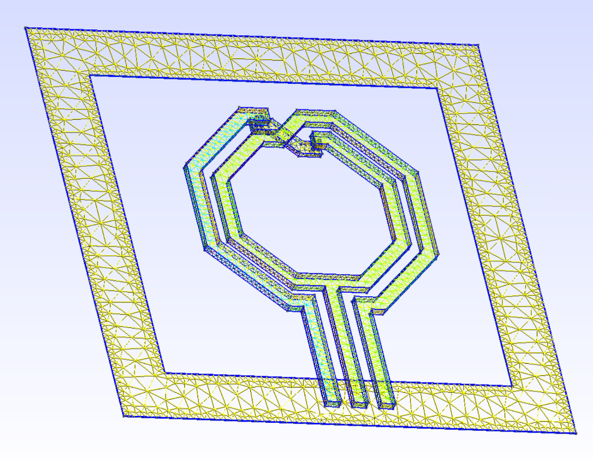
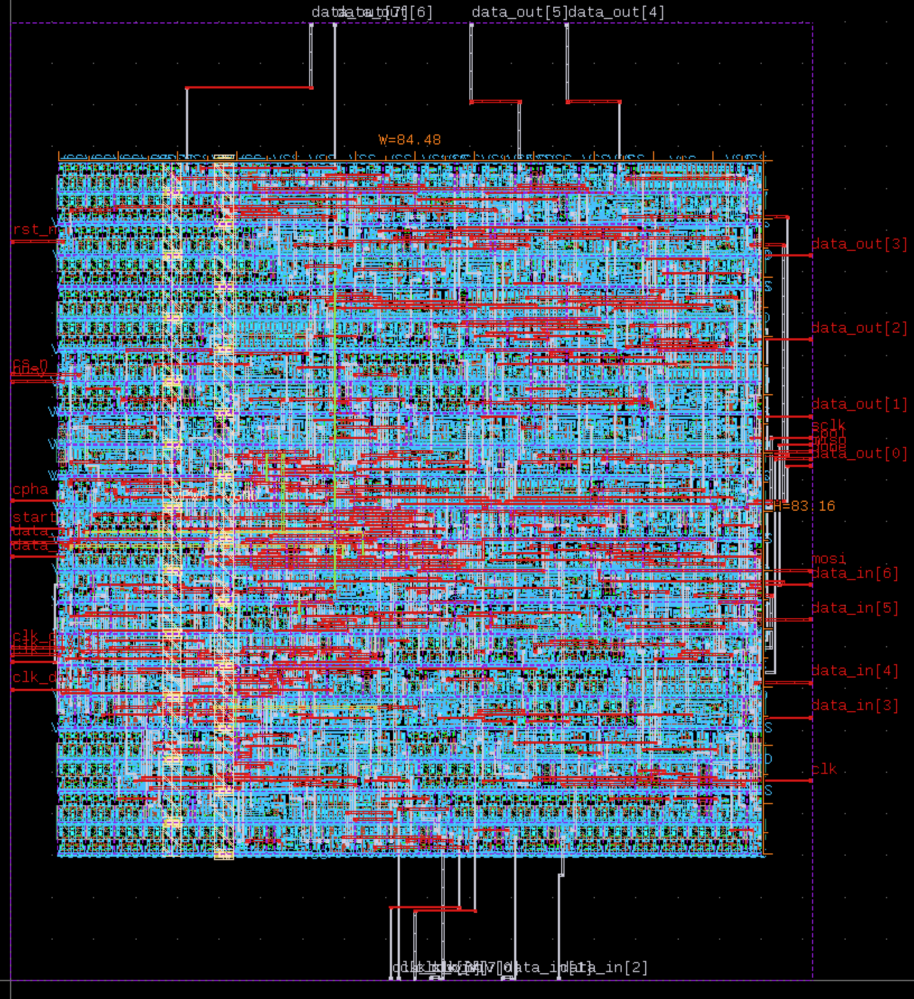

# Analog, Digital, and RF Open-Source IHP Toolchain Setup

<p align="center">
  
</p>

This complementary repository provides an enhanced Dockerfile alongside post-processing scripts specifically designed for working with the IHP SG13G2 open-source PDK inside the `iic-osic-tools` environment.

## Overview

This setup is built on top of the excellent base image provided by the [IIC-OSIC-TOOLS project on GitHub](https://github.com/iic-jku/iic-osic-tools) (Docker: `hpretl/iic-osic-tools`), which provides a vast collection of analog and digital EDA tools.

However, for fully simulating and meshing RF structures, this repository extends the environment with additional steps to support [Volker Muehlhaus's setupEM tool](https://github.com/muehlhaus/setupEM) and the `AWS Palace` 3D EM simulator. The included Python plotting script (`plot_inductor.py`) was also originally provided by Volker Muehlhaus.

This repository automatically applies these patches to your local container.

### Included Patches & Additions:
1.  **Gmsh with OpenCASCADE Support**: Compiles `gmsh` 4.15.0 from source natively with `-DENABLE_OCC=1`, enabling 3D boolean operations and geometry processing required by `gds2palace`.
2.  **Volker's setupEM Tool**: Pip installs `setupEM` alongside precisely pinned dependencies (`gds2palace==0.1.19`, `gdspy==1.6.13`).
3.  **IHP EMStudio GUI**: Clones, compiles, and installs the official `IHP-GmbH/EMStudio` repository from source.
4.  **Global Script Execution Fixes**: Exposes `setupEM`, `EMStudio`, and essential post-processing commands right into your system PATH. It additionally patches the `combine_snp` executable from the localized PDK folder to globally run using your active python interpreter.

---

## 🚀 Quick Start Guide

### 1. Requirements

Before starting, ensure you have **Docker Desktop** (or a compatible Docker engine) installed and running on your system.

### 2. Download & Build Container
Clone this repository and build the container locally. You only need to do this once.

```bash
git clone https://github.com/AliSahafi/Analog_OpenSource_ihp.git
cd Analog_OpenSource_ihp
docker build -t opensource_setupem .
```

### 3. Run Container
Launch the built image using the provided `hpretl/iic-osic-tools` wrapper syntax! We launch the GUI into a headless VNC session over port `:80`.

```bash
docker run -d -p 8080:80 -v $(pwd)/inductor_output:/workdir --name analog_sim opensource_setupem
```

Navigate to **`http://localhost:8080/`** to access the container via the web GUI.
For the full desktop experience, navigate to **`http://localhost:8080/vnc.html`** in your web browser.

> **Note:** The default VNC password for the container is `abc123`

### 4. Start Simulations!
From the XFCE Desktop Terminal within your browser, you can directly run:

```bash
setupEM
# -> GUI and setup tool for the gds2palace RFIC FEM simulation workflow.

EMStudio
# -> Open-source electromagnetic field simulation software using the FDTD method.

KLayout.sh
# -> Launches KLayout with the EMStudio driver fully integrated!
```

**EMStudio Configuration Setup:**
When launching EMStudio for the first time, open **Setup -> Preferences** and ensure the following paths are configured:

*   **EMStudio -> MODEL_TEMPLATES_DIR:** `/opt/emstudio/scripts`
*   **OpenEMS -> Python Path:** `/usr/bin/python3`
*   **Palace -> PALACE_RUN_MODE:** `Script`
*   **Palace -> PALACE_RUN_SCRIPT:** `/opt/emstudio/scripts/run_palace`

---

## 📈 Post-Processing S-Parameters

Included in this repository is `plot_inductor.py`. When your RF simulation in `palace` finishes, it will generate an output directory (e.g. `palace_model/inductor_output`). 

You can extract that folder and run this script locally using `scikit-rf` to plot your parameters smoothly!

```bash
pip install scikit-rf matplotlib

# Generic usage:
python3 plot_inductor.py <path_to_s2p_file> <path_to_deembedded_s2p_file>

# Example for the 500pH Inductor:
python3 plot_inductor.py ./inductor_500pH_with_ports.s2p ./inductor_500pH_with_ports_deembedded.s2p
```

This will output two graphical figures (defaulting to inductor naming):
-   `inductor_plot_diff.png` (Differential Inductor Parameters - L, Q, R)
-   `inductor_plot_pi.png` (Pi Model Parameters)

<p align="center">
  
</p>

---

---

## 🔲 Digital Flow — Verilog to GDS (IHP SG13G2)

The base `iic-osic-tools` image already includes **LibreLane 2.x, OpenROAD, Yosys, Magic, and Netgen** for digital design. However, the IHP SG13G2 PDK configuration had several incompatibilities with LibreLane 2.x that prevented a working Verilog-to-GDS flow. This repository adds the following fixes and tools:

### What Was Added

| Addition | Purpose |
|----------|---------|
| `verilog2gds` script | One-command Verilog → GDS automation |
| `verilator` (apt) | Verilog linting and simulation |
| IHP PDK corner name patches | Fixes `LIB`, `TECH_LEFS`, `RCX_RULESETS` wildcard keys incompatible with LibreLane 2.x |
| `cut_rows.tcl` patch | Skips endcap insertion gracefully when IHP has no endcap cells |
| `tapcell.tcl` patch | Skips tapcell insertion when `FP_TAPCELL_DIST=0` (IHP has no tapcells) |
| `klayout` symlink | Makes KLayout accessible to LibreLane's XOR signoff step |

### Using `verilog2gds`

The `verilog2gds` command is available globally inside the container. It takes your Verilog source file and runs the complete RTL-to-GDS flow using LibreLane with the IHP SG13G2 PDK.

**Basic usage:**
```bash
verilog2gds <your_design.v>
```

**Full argument reference:**

```
usage: verilog2gds [-h] [--module MODULE] [--clock-port CLOCK_PORT]
                   [--clock-period CLOCK_PERIOD] [--utilization UTILIZATION]
                   [--pdk PDK] [--full-timing]
                   verilog_file

positional arguments:
  verilog_file                    Path to the Verilog source file

optional arguments:
  -h, --help                      Show this help message and exit
  --module, -m MODULE             Top module name (default: filename stem)
  --clock-port, -c CLOCK_PORT     Clock port name (default: clk)
  --clock-period, -p CLOCK_PERIOD Clock period in ns (default: 10.0 ns = 100 MHz)
  --utilization, -u UTILIZATION   Core utilization % (default: 10)
  --pdk PDK                       PDK to use: ihp-sg13g2 or sky130A (default: ihp-sg13g2)
  --full-timing                   Run all 3 timing corners instead of typical only (slower)
```

**Examples:**

```bash
# Simple run — defaults to 100 MHz clock, 10% utilization
verilog2gds counter.v

# Compact layout at 50% utilization, 200 MHz clock
verilog2gds my_design.v --utilization 50 --clock-period 5

# Specify a different top module name and clock port
verilog2gds top.v --module my_top --clock-port sys_clk

# Full 3-corner timing analysis for signoff
verilog2gds my_design.v --utilization 40 --full-timing

# Use sky130A PDK instead
verilog2gds my_design.v --pdk sky130A
```

**Output:** GDS files are written to `./<module_name>_run/runs/<RUN_DATE>/`

> **Tip:** The default 10% utilization creates a large sparse layout. Use `--utilization 40-50` for compact production layouts. Values above 70% may cause routing failures.

### Example: SPI Master

A complete SPI master (Mode 0/3, configurable clock divider, 8-bit TX/RX) was synthesised and laid out using this flow:

```bash
verilog2gds spi_master.v --utilization 40 --clock-period 10
```

Results: **227 cells**, Antenna ✅, DRC ✅, LVS ✅, IR drop 0.17%

<p align="center">
  
</p>

---

## 🙌 Acknowledgments

*   **SetupEM & gds2palace**: Developed and maintained by **Volker Muehlhaus**. ([GitHub](https://github.com/muehlhaus/setupEM))
*   **plot_inductor.py**: The plotting script provided in this repository was originally authored by **Volker Muehlhaus**.
*   **Base Docker Image**: The underlying IC design environment is provided by the excellent **IIC-OSIC-TOOLS** project. ([GitHub](https://github.com/iic-jku/iic-osic-tools) | [Docker Hub](https://hub.docker.com/r/hpretl/iic-osic-tools))
