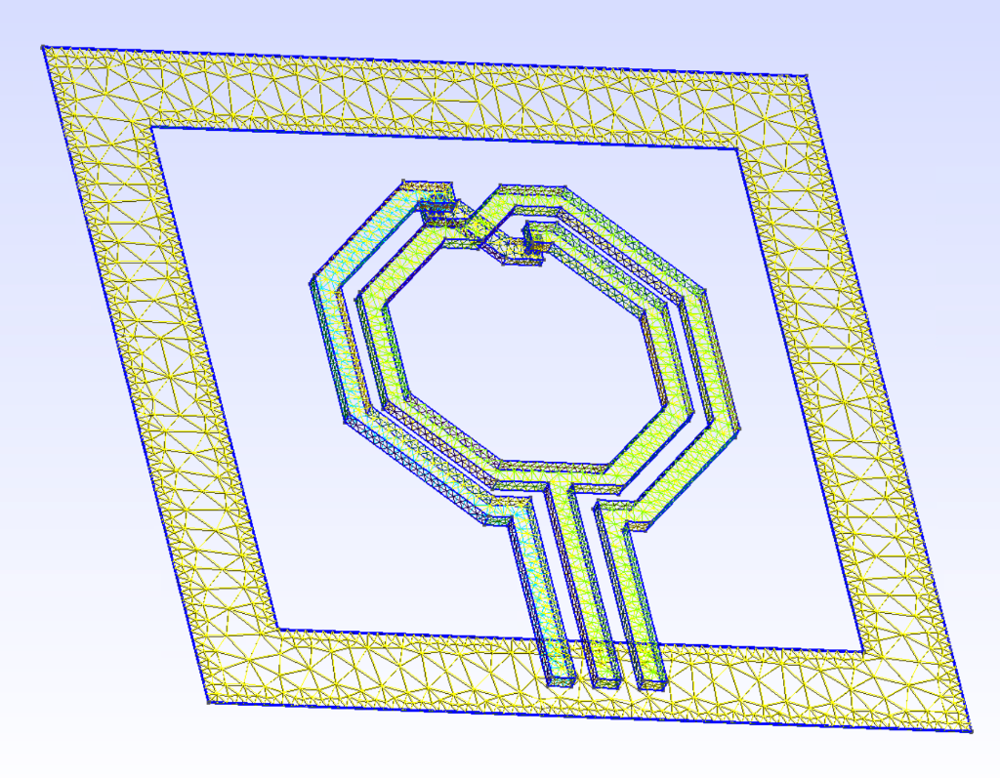
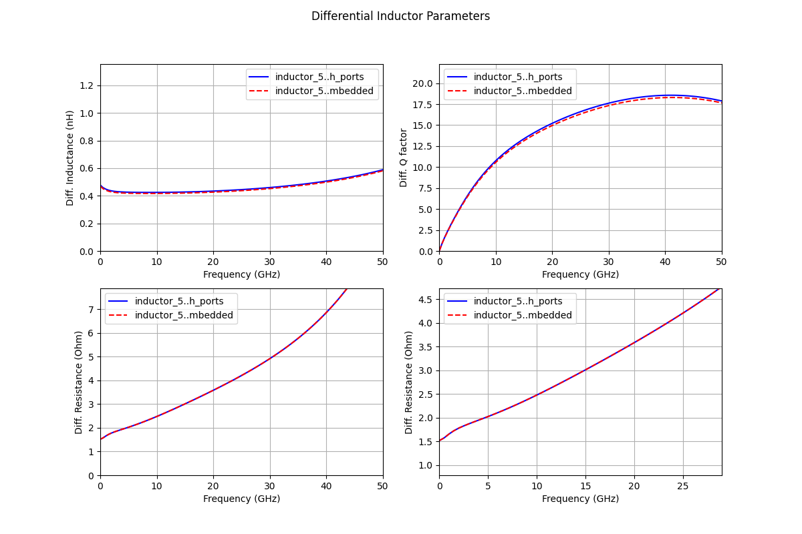
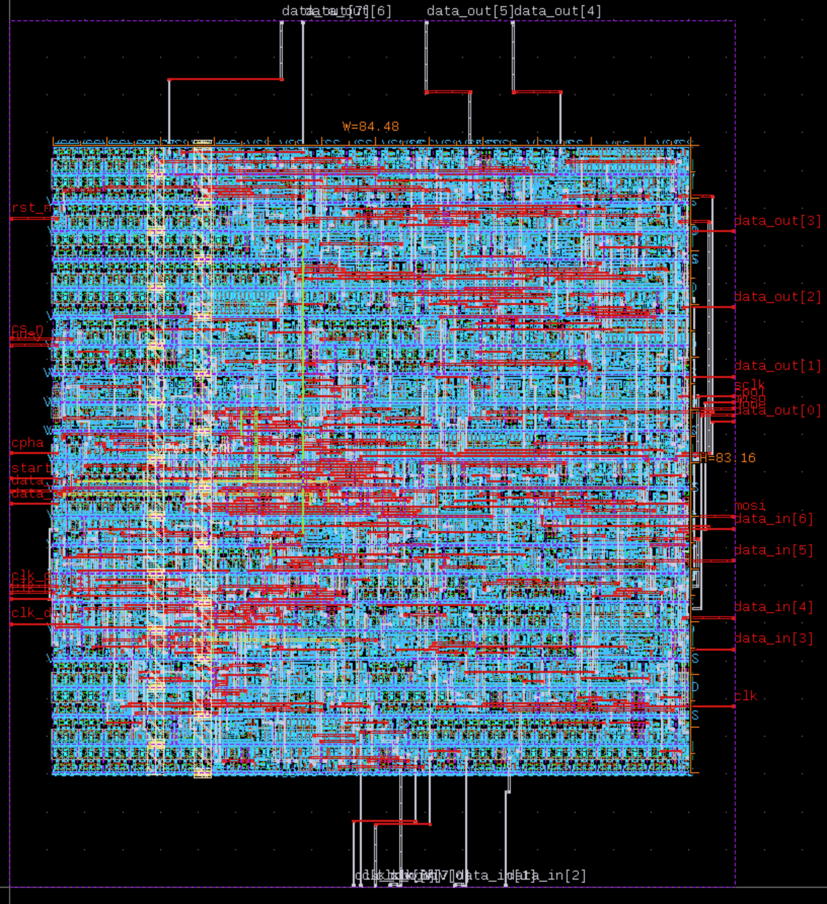

# Analog, Digital, and RF Open-Source IHP Toolchain Setup

<p align="center">
  
</p>

This repository provides an enhanced Dockerfile and post-processing scripts for working with the **IHP SG13G2 open-source 130nm PDK** inside the `iic-osic-tools` environment.

## Overview

Built on top of [IIC-OSIC-TOOLS](https://github.com/iic-jku/iic-osic-tools) (`hpretl/iic-osic-tools:2026.07`), which already bundles 100+ analog/digital EDA tools (KLayout, OpenROAD, Yosys, Magic, Netgen, LibreLane, and more).

This repo extends the base image with:

| Addition | Purpose |
|----------|---------|
| **EMStudio** (compiled from source) | IHP's Qt5-based EM structure editor — supports openEMS and Palace |
| **setupEM + gds2palace** | Guided GUI for Palace EM simulations; GDS-to-Palace geometry converter |
| **padgen** | IHP SG13G2 pad ring & full-chip project scaffold generator (LibreLane Chip flow) |
| **verilog2gds** | One-command Verilog → GDS via LibreLane + IHP SG13G2 |
| **vhdl2gds** | One-command VHDL → GDS via LibreLane + IHP SG13G2 |
| **plot_inductor.py** | S-parameter post-processing and inductor characterisation |
| **IHP PDK patches** | Corner name fixes, PDN variables, and Tcl script patches for LibreLane 3.x |
| **Shell aliases** | `emstudio`, `inductor`, `pdk-ihp` shortcuts in every terminal |
| **XFCE desktop shortcut** | EMStudio launcher in the Applications menu |

---

## 🚀 Quick Start

### 1. Requirements

- **Docker** (Desktop or Engine) installed and running
- **Docker Compose** (included in Docker Desktop; or `docker compose` plugin)

### 2. Clone & Launch

```bash
git clone https://github.com/AliSahafi/Analog_OpenSource_ihp.git
cd Analog_OpenSource_ihp

# (Optional) copy and edit the configuration file
cp .env.example .env

# Create local designs folder and populate with starter examples
mkdir -p designs && cp -r examples/* designs/

# Build the image and start the container
docker compose up -d --build
```

The first build takes ~10–20 min (compiles EMStudio from source).

### 3. Open the Desktop

Navigate to **`http://localhost:8080/vnc.html`** in your browser for the full noVNC desktop.

> VNC client: connect to `localhost:5902`
> Default VNC password: `abc123`

### 4. Your Design Files

Your local `./designs/` folder is mounted inside the container at `/foss/designs` (the default working directory). Anything saved there persists on your host after the container stops.

### 5. Configuration (Optional)

Edit `.env` (copied from `.env.example`) to override defaults:

```ini
NOVNC_PORT=8080      # browser desktop port
VNC_PORT=5902        # VNC client port
DESIGNS=./designs    # host path for design files
PALACE_NP=4          # MPI cores for Palace (default: all cores)
```

### Useful Commands

```bash
docker compose up -d          # start container (uses cached image)
docker compose up -d --build  # rebuild image and start
docker compose down           # stop and remove container
docker compose logs -f        # follow container logs
```

---

## 🧲 RF/EM Flow — EMStudio & Palace

From the XFCE desktop terminal inside the browser:

```bash
EMStudio     # or type: emstudio
setupEM
KLayout.sh   # KLayout with EMStudio driver integrated
```

**First-time EMStudio setup** — open **Setup → Preferences** and set:

| Setting | Value |
|---------|-------|
| EMStudio → `MODEL_TEMPLATES_DIR` | `/opt/emstudio/scripts` |
| OpenEMS → `Python Path` | `/usr/bin/python3` |
| Palace → `PALACE_RUN_MODE` | `Script` |
| Palace → `PALACE_RUN_SCRIPT` | `/opt/emstudio/scripts/run_palace` |

Palace runs with all available CPU cores by default. Override with `PALACE_NP=4` in `.env`.

---

## 📈 Post-Processing S-Parameters

`plot_inductor.py` is available directly inside the container (and in this repo for local use).

```bash
# Inside the container:
inductor <path_to_s2p_file> <path_to_deembedded_s2p_file>

# Example for the 500pH Inductor:
inductor ./inductor_500pH_with_ports.s2p ./inductor_500pH_with_ports_deembedded.s2p
```

Outputs two PNG figures to your working directory:
- `inductor_plot_diff.png` — Differential parameters (L, Q, R)
- `inductor_plot_pi.png` — Pi-model parameters

<p align="center">
  
</p>

---

## 🔲 Digital Flow — Verilog/VHDL to GDS (IHP SG13G2)

`verilog2gds` and `vhdl2gds` are available globally inside the container. They generate a LibreLane `config.json` for IHP SG13G2 and run the complete RTL-to-GDS flow.

> **⚠️ VHDL Note:** `vhdl2gds` uses Yosys + GHDL plugin. It is intended for **educational use** on simple designs. For production flows, use Verilog.

**Basic usage:**

```bash
verilog2gds counter.v
vhdl2gds spi_master.vhd
```

**Full argument reference:**

```
usage: verilog2gds [-h] [-m MODULE] [-c CLOCK_PORT] [-p CLOCK_PERIOD]
                   [-u UTILIZATION] [-a ASPECT_RATIO]
                   [--die-width DIE_WIDTH] [--die-height DIE_HEIGHT]
                   [--pin-config PIN_CONFIG] [--pdk PDK] [--full-timing]
                   [--extra-libs [...]] [--extra-lefs [...]]
                   [--output-load OUTPUT_LOAD] [--max-fanout MAX_FANOUT]
                   verilog_file

positional arguments:
  verilog_file                    Path to the Verilog source file

optional arguments:
  -h, --help                      Show this help message and exit
  -m, --module MODULE             Top module name (default: filename stem)
  -c, --clock-port CLOCK_PORT     Clock port name (default: clk)
  -p, --clock-period CLOCK_PERIOD Clock period in ns (default: 20 ns = 50 MHz)
  -u, --utilization UTILIZATION   Core utilization % (default: 30)
  -a, --aspect-ratio ASPECT_RATIO Aspect ratio H/W (default: 1.0 = square)
  --die-width DIE_WIDTH           Exact die width in µm — overrides utilization/aspect-ratio
  --die-height DIE_HEIGHT         Exact die height in µm — must pair with --die-width
  --pin-config PIN_CONFIG         Pin order/placement config file (FP_PIN_ORDER_CFG)
  --pdk PDK                       PDK name (default: ihp-sg13g2)
  --full-timing                   Run all 3 timing corners (typ/fast/slow) — slower
  --extra-libs [...]              Extra .lib files to include
  --extra-lefs [...]              Extra .lef files to include
  --output-load OUTPUT_LOAD       Output capacitive load in fF (OUTPUT_CAP_LOAD)
  --max-fanout MAX_FANOUT         Maximum fanout constraint for synthesis
```

> `vhdl2gds` has the same options; use `--entity` instead of `--module`.

**Examples:**

```bash
# Simple run — 50 MHz clock, 30% utilization
verilog2gds counter.v

# 200 MHz clock, compact 50% utilization
verilog2gds my_design.v --utilization 50 --clock-period 5

# Exact die size
verilog2gds my_design.v --die-width 300 --die-height 200

# Full 3-corner timing signoff
verilog2gds my_design.v --utilization 40 --full-timing

# VHDL
vhdl2gds spi_master.vhd --entity spi_master --clock-port clk
```

**Output:** GDS files are written to `./<module>_run/runs/<RUN_DATE>/`

### Example: SPI Master

```bash
verilog2gds spi_master.v --utilization 40 --clock-period 10
```

Results: **227 cells**, Antenna ✅, DRC ✅, LVS ✅, IR drop 0.17%

<p align="center">
  
</p>

---

## 🏛️ Pad Ring & Full-Chip Flow — `padgen` (IHP SG13G2)

`padgen` is a CLI tool available inside the container and on the host that automates the complete full-chip pad ring flow for the IHP SG13G2 PDK. From a simple YAML pad list, it:

1. **Calculates Optimal Die & Core Sizing:** Automatically determines `DIE_AREA` and `CORE_AREA` aligned to integer filler boundaries.
2. **Generates `src/<design>.sv`:** SystemVerilog top-level wrapper with instantiated IHP SG13G2 IO pads (`sg13g2_IOPad*`), bus generate loops, internal wiring, and core mapping.
3. **Generates `src/<core>.sv`:** Core logic module stub.
4. **Generates `librelane/config.yaml`:** LibreLane 3.x Chip-flow configuration with `PAD_SOUTH`, `PAD_EAST`, `PAD_NORTH`, `PAD_WEST`, power nets (`VDD`, `VSS`), and signoff controls.
5. **Streams directly to GDS (optional):** With `--build`, executes LibreLane end-to-end to produce the final chip GDS.

### Supported IHP SG13G2 IO Pad Cells

| Type | Cell Master | Drive Strengths | Direction |
|---|---|---|---|
| `input` | `sg13g2_IOPadIn` | — | Digital In |
| `output` | `sg13g2_IOPadOut{4,16,30}mA` | 4, 16, 30 mA | Digital Out |
| `tristate` | `sg13g2_IOPadTriOut{4,16,30}mA` | 4, 16, 30 mA | Tri-state Out |
| `bidir` | `sg13g2_IOPadInOut{4,16,30}mA` | 4, 16, 30 mA | Bidirectional |
| `analog` | `sg13g2_IOPadAnalog` | — | Analog Pass-through |
| `iovdd` / `iovss` | `sg13g2_IOPadIOVdd` / `sg13g2_IOPadIOVss` | — | 3.3V IO Supply |
| `vdd` / `vss` | `sg13g2_IOPadVdd` / `sg13g2_IOPadVss` | — | 1.2V Core Supply |

### Usage & Examples

```bash
# 1. Generate an annotated template pad list
padgen --example > my_chip.yaml

# 2. Preview generated config and Verilog top without writing
padgen my_chip.yaml --dry-run

# 3. Generate project scaffold in ./my_chip/
padgen my_chip.yaml -o ./my_chip

# 4. Generate project AND immediately synthesize to full-chip GDS
padgen my_chip.yaml -o ./my_chip --build

# 5. Override die dimensions (in microns)
padgen my_chip.yaml --die-width 1600 --die-height 1600 --build
```

---

## 🖥️ Graphical & Remote Desktop Access

| Access Method | Connection URL / Address | Credentials | Best For |
|---|---|---|---|
| **Web Browser (noVNC)** | `http://localhost:8080/vnc.html` | Password: `abc123` | Instant browser access, zero installation |
| **TigerVNC Viewer** | `localhost:5902` | Password: `abc123` | High-speed layout viewing & EDA tools |
| **Remmina (Linux)** | `localhost:5902` (Protocol: VNC) | Password: `abc123` | Desktop GUI connection management |
| **CLI / Host Terminal** | `docker exec -it ihp-osic bash` | — | Headless scripting & automated runs |

---

## 📁 File Sharing Between Host and Container

The `./designs` folder on your host is bind-mounted directly to `/foss/designs` inside the container:
- Files created or edited in `./designs` on your PC appear immediately at `/foss/designs` in the container.
- All GDS layouts, reports, and build artifacts saved in `/foss/designs` persist on your host machine.

---

## 🙌 Acknowledgments

- **SetupEM & gds2palace**: Developed and maintained by **Volker Muehlhaus** ([GitHub](https://github.com/volkermuehlhaus/setupEM))
- **plot_inductor.py**: Originally authored by **Volker Muehlhaus**
- **Base Docker Image**: **IIC-OSIC-TOOLS** project ([GitHub](https://github.com/iic-jku/iic-osic-tools) | [Docker Hub](https://hub.docker.com/r/hpretl/iic-osic-tools))
